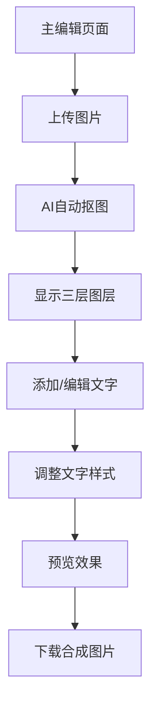

## 1. Product Overview
PosterLayer AI 是一个单页Web应用，用户可以通过AI技术将旅行照片中的人物自动抠图，并添加自定义文字图层，最终导出合成后的精美图片。该产品解决了用户想要快速制作高质量旅行海报的需求，无需专业设计技能即可获得专业级效果。

目标用户：喜欢分享旅行经历的社交媒体用户、摄影爱好者、内容创作者。产品价值在于降低设计门槛，让每个人都能轻松创作出具有小红书风格的精美旅行海报。

## 2. Core Features

### 2.1 User Roles
本应用为单用户工具，无需注册登录即可使用全部功能。

### 2.2 Feature Module
PosterLayer AI 包含以下核心功能页面：
1. **主编辑页面**：图片上传区域、图层预览区、文字编辑工具栏、导出按钮。

### 2.3 Page Details
| Page Name | Module Name | Feature description |
|-----------|-------------|---------------------|
| 主编辑页面 | 图片上传模块 | 点击或拖拽上传旅行照片，支持JPG/PNG格式，最大10MB |
| 主编辑页面 | 图层预览区 | 实时显示三层图层：底层原图、中层文字、顶层抠图人物，支持图层透明度调节 |
| 主编辑页面 | 文字编辑工具 | 输入自定义文字内容，拖拽调整位置，滑块调节文字大小、颜色选择器、字体下拉选择 |
| 主编辑页面 | 导出功能 | 一键下载合成后的图片，支持PNG格式导出 |
| 主编辑页面 | AI抠图状态 | 显示抠图进度，提供重新抠图选项 |

## 3. Core Process
用户操作流程：
1. 用户进入主编辑页面
2. 上传旅行照片
3. 系统自动调用AI抠图API处理图片
4. 在图层预览区显示抠图结果
5. 用户添加并编辑文字内容
6. 调整文字位置、大小、颜色、字体
7. 预览最终效果
8. 点击下载按钮导出合成图片

## 4. User Interface Design

### 4.1 Design Style
- **主色调**：温暖米色 (#FAF7F2) 背景，搭配深灰色 (#2C2C2C) 文字
- **强调色**：小红书风格红色 (#FF2442) 用于按钮和重要元素
- **按钮样式**：圆角矩形，轻微阴影效果，悬停状态颜色加深
- **字体**：中文使用思源黑体，英文使用Inter，主要文字14-16px，标题18-24px
- **布局风格**：卡片式布局，大量留白，居中对称设计
- **图标风格**：线性图标，简洁现代，使用Feather Icons或类似风格

### 4.2 Page Design Overview
| Page Name | Module Name | UI Elements |
|-----------|-------------|-------------|
| 主编辑页面 | 图片上传区域 | 虚线边框上传框，中心位置，大小400x300px，上传按钮使用红色背景白色文字，支持拖拽上传 |
| 主编辑页面 | 图层预览区 | 全屏背景，原图作为底层，抠图人物置顶显示，文字层可拖拽，半透明遮罩突出文字编辑区域 |
| 主编辑页面 | 文字编辑工具栏 | 底部固定工具栏，包含文字输入框、字体大小滑块(12-48px)、颜色选择器、字体选择下拉框 |
| 主编辑页面 | 导出按钮 | 右上角红色圆形按钮，内含下载图标，悬停时显示"下载海报"提示 |

### 4.3 Responsiveness
桌面端优先设计，适配1200px以上宽度。移动端采用响应式布局，工具栏改为底部抽屉式，上传区域全屏显示。

### 4.4 3D Scene Guidance
本应用为2D图层叠加，无需3D场景。但建议为图层切换添加微妙的过渡动画：
- 图层切换使用淡入淡出效果，持续300ms
- 文字拖拽时添加轻微阴影提升层次感
- 按钮点击采用缩放动画，增强交互反馈